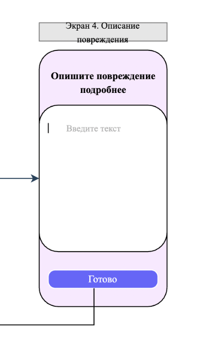
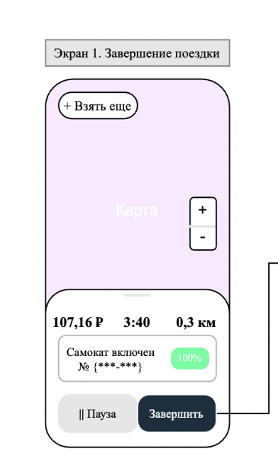

# Критерии приемки

User story: Я как пользователь приложения МТС Юрент 
хочу иметь возможность завершить поездку вне зоны парковки, описав причину поломки,
для того, чтобы самокат, не пригодный к использованию, не был выпущен на линию.

## Номер кейса: 1

Функциональность: Завершение поездки вне зоны парковки.
Дано: Пользователь находится на Экране 4 (Описание повреждения).
Когда: Пользователь не вводит подробное описание повреждения.
Тогда: Кнопка "Готово" не активна, нельзя завершить поездку.

## Номер кейса: 2

Функциональность: Завершение поездки вне зоны парковки.
Дано: Пользователь находится на Экране 4 (Описание повреждения).
Когда: Пользователь вводит описание повреждения, нажимает кнопку "Готово", но произошла ошибка передачи данных.
Тогда: Выводится ошибка: "Не удалось добавить описание неисравности и завершить поездку. Попробуйте еще раз", Пользователь возвращается на Экран 1 (Завершение поездки).

 
 

# Нефункциональные требования

Требования надежности:
1. Система должна быть доступна 99% времени.  
 

Требования производительности:
1. Страница выбора неисправности должна открываться не более 2 секунд.
2. Запрос добавления неисправности POST rentals/defect должен выдерживать нагрузку 1 rps.