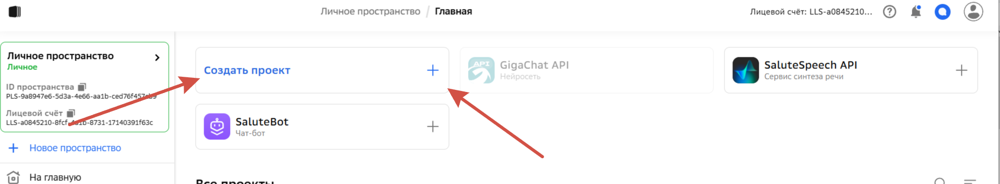
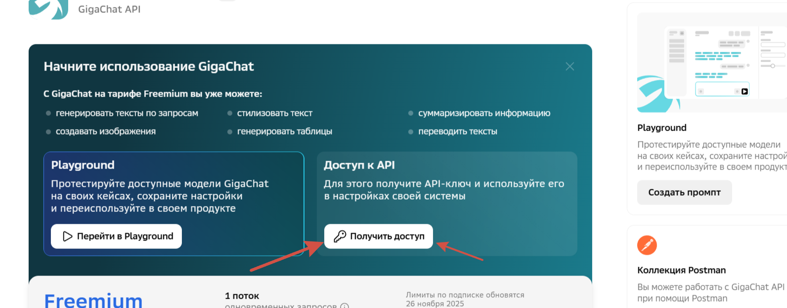
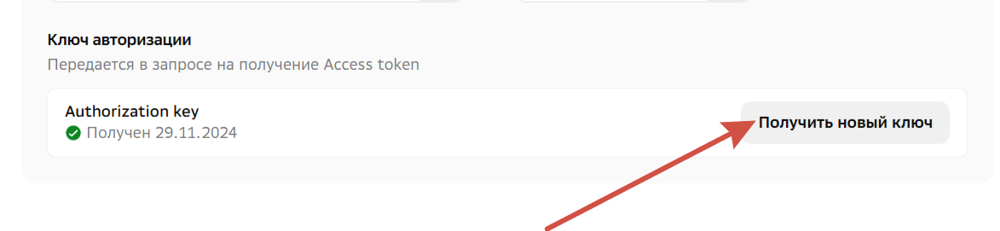

##### Для того, чтобы использовать проект вам надо:
1. **Получить персональный Authorization key**
2. **Скачать необходимые библиотеки**
3. **Запустить программу через консоль при помощи команды: streamlit run *pathToPythonScript***

### Получение персонального Authorization key
1. [Зарегистрироваться в личном кабинете](https://developers.sber.ru/docs/ru/gigachat/quickstart/legal-tokens-purchase) для получения ключа авторизации.
2. В ЛК создать новое Gigachat-приложение

3. Получить и записать свой Authorization key.
    Шаг a)

Шаг б)

### Скачивание библиотек
1. pip install streamlit
2. pip install langchain_gigachat

### Запуск
Запустить программу через консоль при помощи команды: streamlit run *pathToPythonScript*
