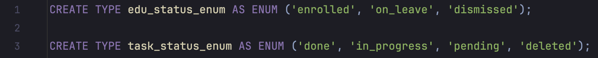
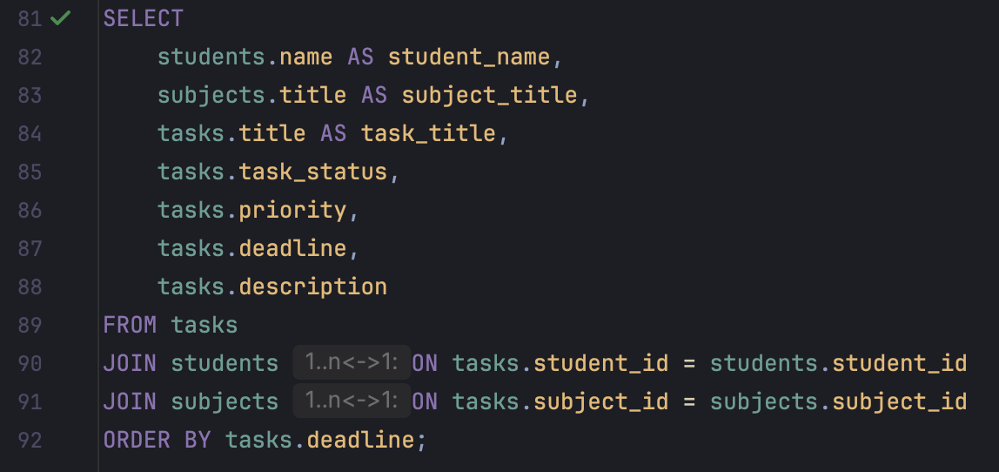
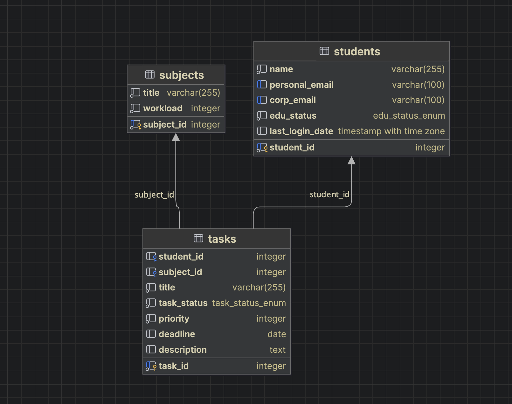

1) Создаем enums для статусов студентов и задач 
 

 

2) Создаем таблицу студентов, где личная и корпоративная почты должны быть уникальными, имя студента должно быть заполнено 
 

 

3) Создаем таблицу дисциплин 
 

 

4) Создаем таблицу задач. Делаем проверку на дату дедлайна, значение приоритета и задаем определение ограничения внешнего ключа студента и дисциплины 
 

 

5) Создадим функцию и напишем триггер, проверяющий, что студент находится в статусе "обучается", тогда и только тогда он может создавать задачи, если студент в статусе "в академическом отпуске" или "отчислен", то задачу он создать не может 
 

 

6) Вводим начальные данные для всех таблиц 
 

 

7) Проверяем, что триггер работает 
 

 

8) Протестируем работу запроса, который выводит задачи всех студентов, упорядоченные по дедлайну 
 

 

 

9) Выведем ER-диаграмму, нарисованную средствами IDE 
 

 
