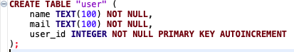
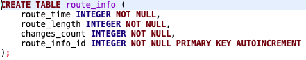
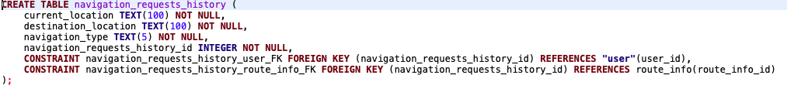
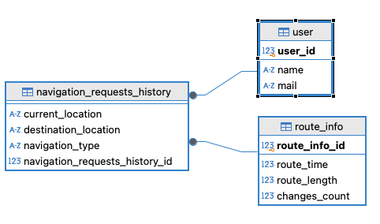

1) Создаем таблицу "пользователей", где поля "имя" и "почта" должны быть не пустыми. 

	
 

2) Создаем таблицу "записей с информацией о маршруте", где поля "время в пути", "длина маршрута" и "количество пересадок" должны быть не пустыми. 

 

3) Создаем таблицу "записей истории навигации", где поля "текущая локация", "локация назначения" и "тип навигации" должны быть не пустыми. Так же должны быть указаны соответствующий пользователь "пользователь" и соответствующая "запись с информацией о маршруте" 

 

4) Выведем ERD диаграмму, сгенерированную DBeaver'ом 

 
