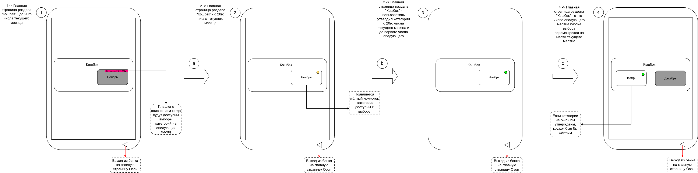
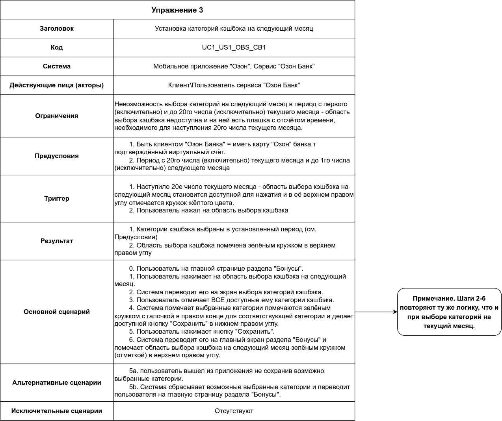

# Домашнее задание 1

Написание случая использования (use case).

Основа:

1. пользовательская история (user story): [ex01](../ex01/README.md)
2. макет по пользовательской истории с показом успешного случая: [ex02](../ex02/README.md)

## Упражнение

